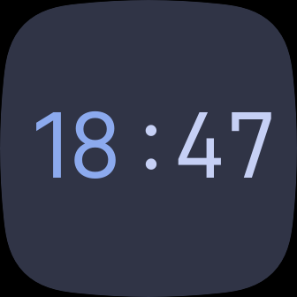
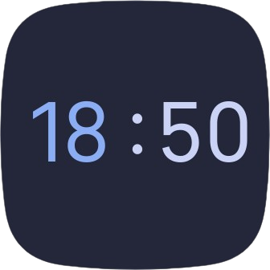
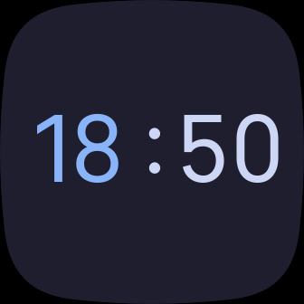
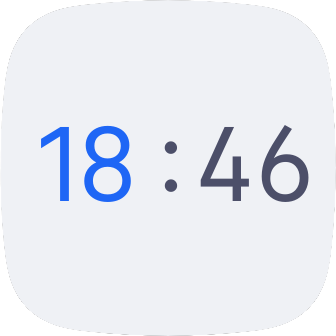
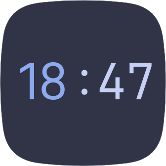
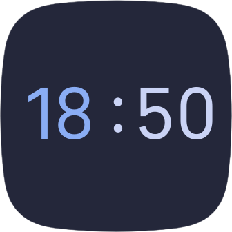

<h3 align="center">
	 
	
	Catppuccin for <a href="https://fitbit.com/">Fitbit</a>
	
</h3>

	
	
	

	 
  
   

## Previews

🌻 Latte

🪴 Frappé

🌺 Macchiato

🌿 Mocha

## Usage
### Versa 3/Sense
1. Go to the clock galllery in your fitbit app (or click [here](https://gallery.fitbit.com/details/845086d5-34d2-4765-b099-34ebd718b1da) to open it in the website.).
2. Search for Catppuccin.
3. Install and give all permissions.
4. Enjoy.

### Versa 1/2/Lite
1. Go to the clock gallery in your fitbit app.
2. Search "FitFace" and install it.
3. Press on "Settings" (under the clock).
4. Sign in or log into your FitFace account.
5. In your browser log in your FitFace account ([fitface.xyz](https://fitface.xyz/)).
6. Click [here](https://fitface.xyz/gallery/user/46fb5e65566445749684cbb49e66d51d).
7. Select your favorite Catppuccin clock.
8. Press on "Add To Favorite".
9. On the fitbit go on FitFace settings and go to "Select another design".
10. Press on "Favourites" and press on your Catppuccin clock.
11. Enjoy.

## 💝 Thanks to

- [lighttigerXIV](https://github.com/lighttigerXIV)
- [LeBazarDeBryan](https://github.com/LeBazarDeBryan)

&nbsp;

	

	Copyright &copy; 2021-present <a href="https://github.com/catppuccin" target="_blank">Catppuccin Org</a>

	

